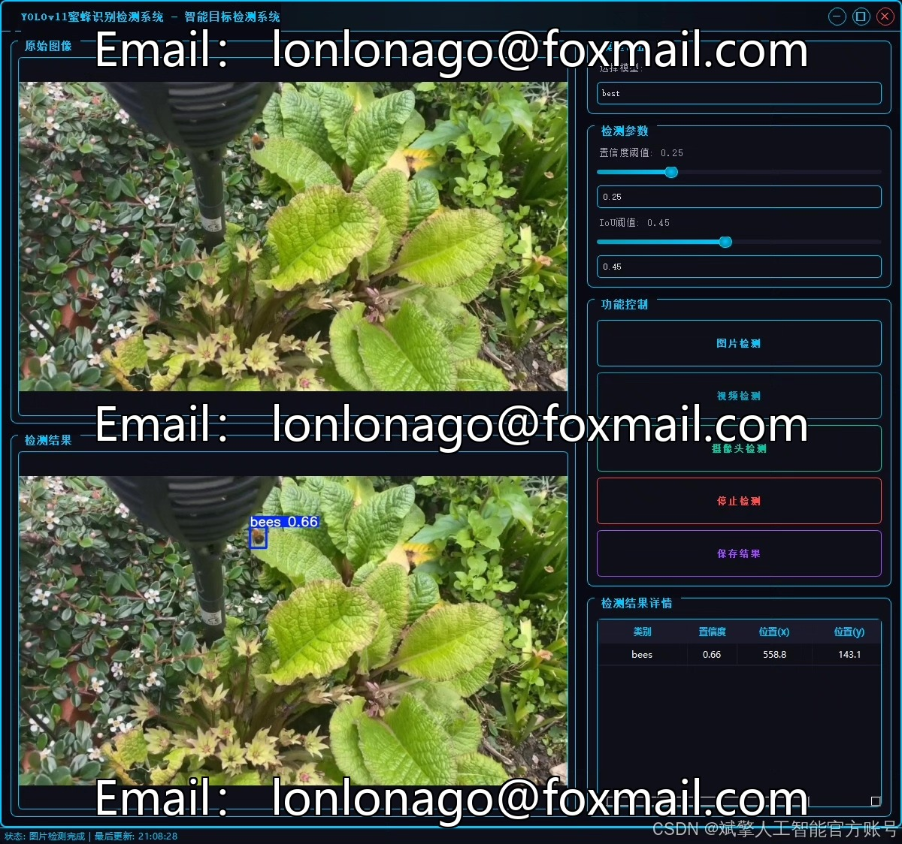
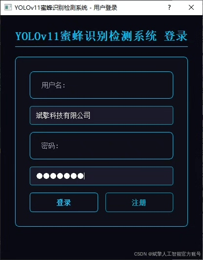
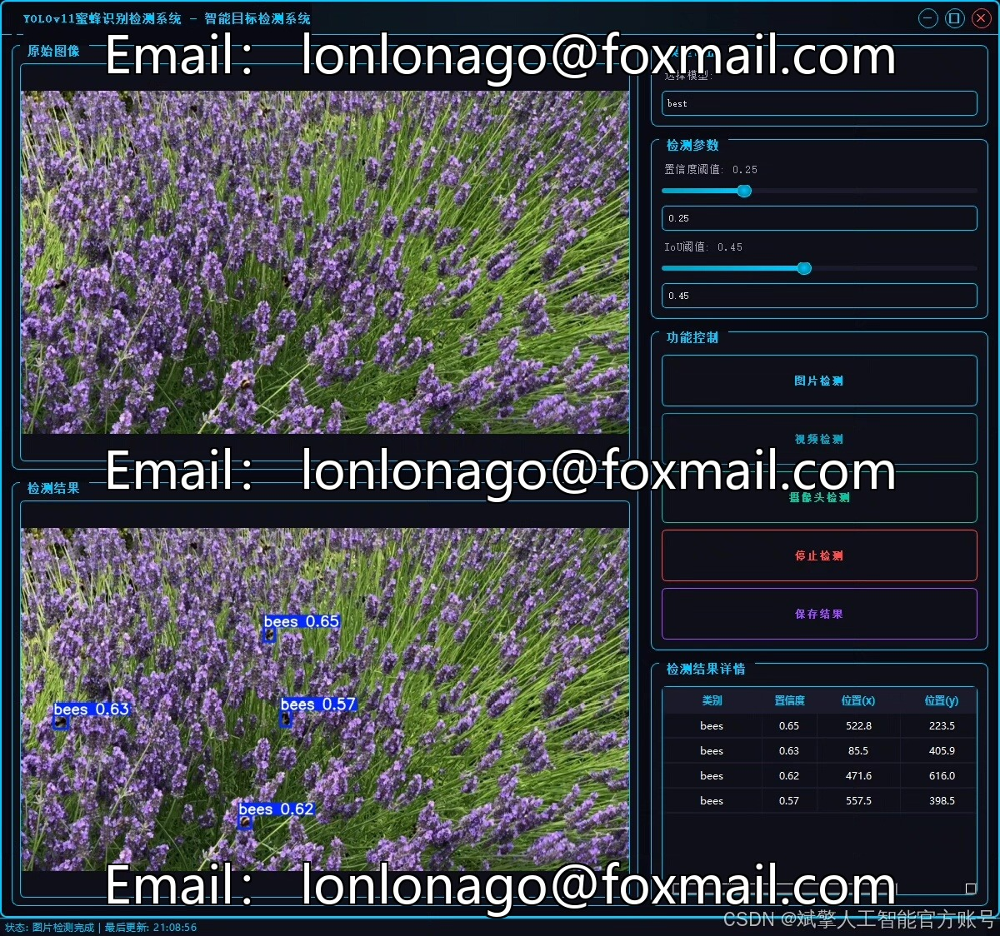
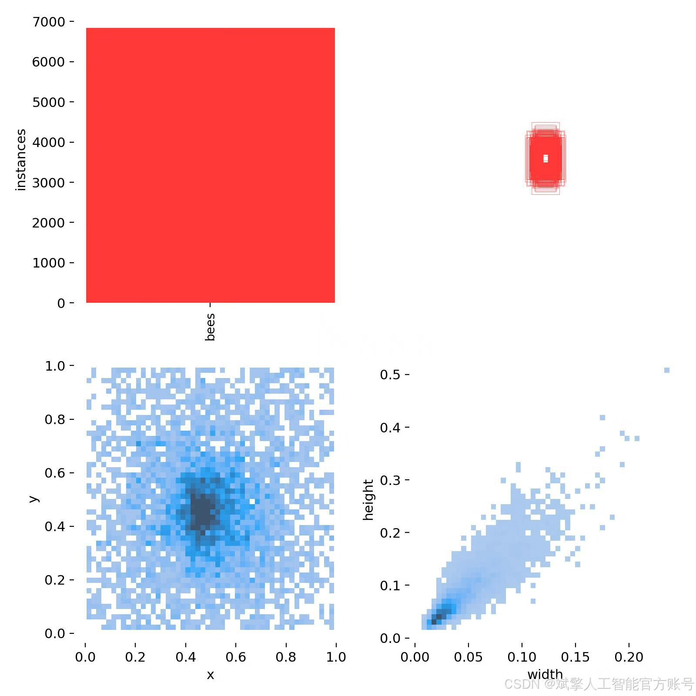
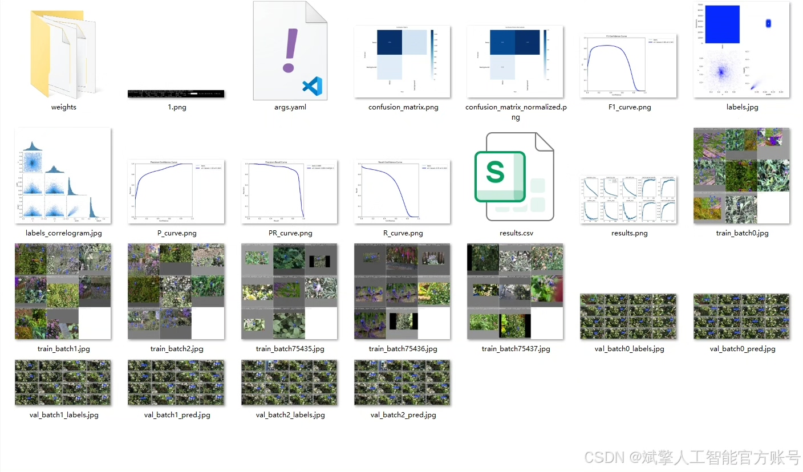
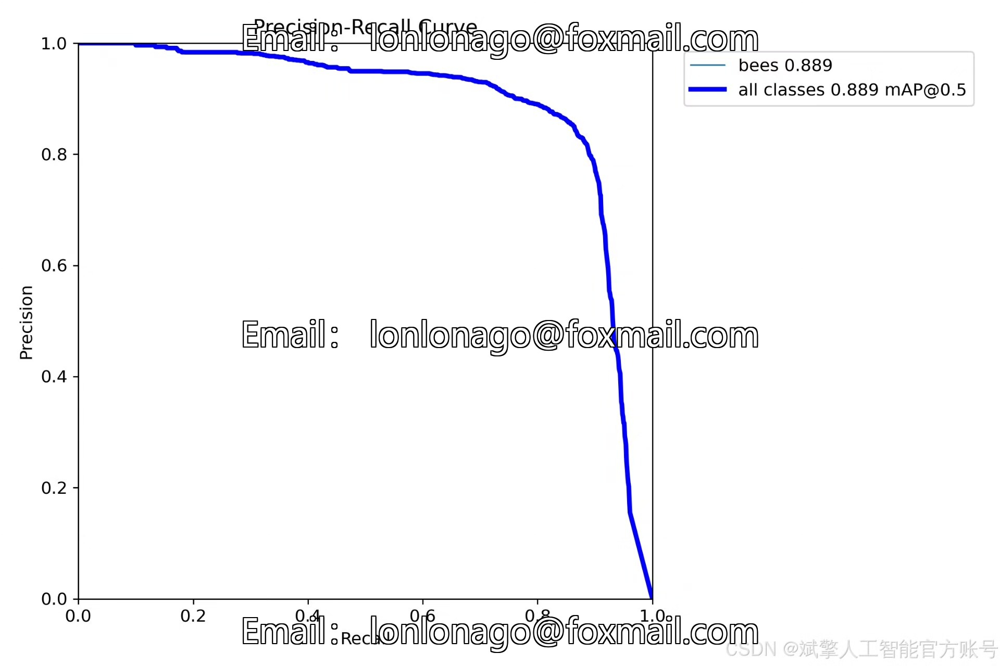
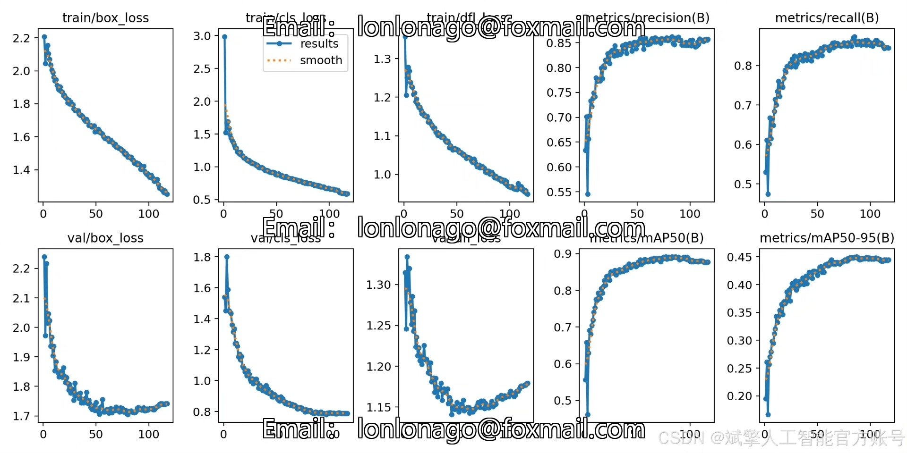
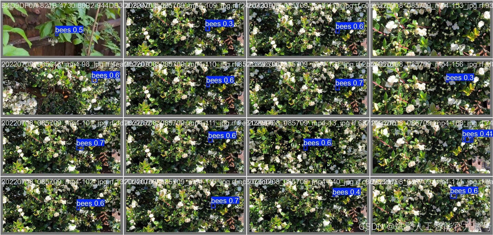

# YOLOv11 Bee Detection System

## Body

YOLOv11 Bee Identification System Based on Deep Learning YOLOv11: A Bee Identification and Detection System (YOLOv11+YOLO dataset + UI interface + login registration interface + Python project source code + model)

This paper designs and implements a bee identification and detection system based on the deep learning target detection algorithm YOLOv11. The system aims to meet the needs of efficient, automated monitoring of bee populations in modern agriculture and ecological research. The project utilizes a large-scale, high-quality custom bee image dataset, which contains a total of 8078 images, including 5640 training sets, 1604 validation sets, and 836 test sets, all of which are finely labeled, containing only the category 'bees' (nc: 1), ensuring the focus and accuracy of the model training.

✅ User Login and Registration: Supports password verification and security validation.
✅ Three Detection Modes: Based on the YOLOv11 model, supports image, video, and real-time camera detection, accurately identifying targets.
✅ Dual-Screen Comparison: Displays the original scene and detection results simultaneously on the screen.
✅ Data Visualization: Real-time table displays the category, confidence, and coordinates of detected targets.
✅ Intelligent Parameter Tuning: Offers a confidence slide bar for dynamically optimizing detection accuracy, adapting to different scene requirements.
✅ Sci-Fi Interactive Interface: Dark theme paired with dynamic light effects, reducing visual fatigue and enhancing operational experience.

## Images

## Payment

Here is a pay link on Stripe ( https://buy.stripe.com/3cs8yP7sY87d0vu9AB ). Please contact me lonlonago@foxmail.com after funding $89, and I will send you a complete data files , thank you!

